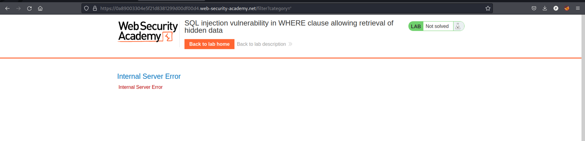
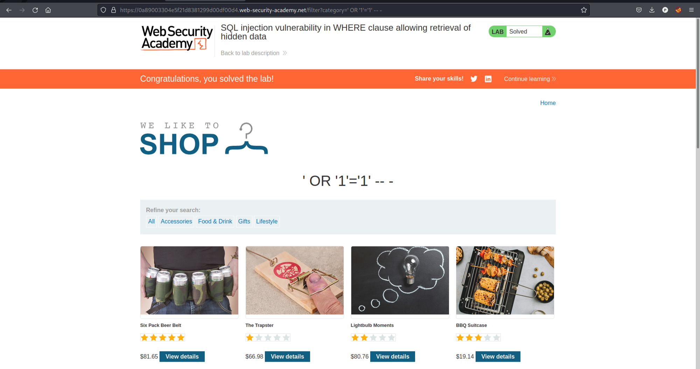

# [Lab 1: SQL Injection Vulnerability in WHERE Clause Allowing Retrieval of Hidden Data](https://portswigger.net/web-security/sql-injection/lab-retrieve-hidden-data)


### Overview
This lab demonstrates an SQL injection vulnerability in the WHERE clause, allowing an attacker to retrieve hidden data. The lab involves modifying URL parameters to exploit the vulnerability.

### Steps to Exploit

1. **Identify the Vulnerable Parameter:**
   - Navigate to different categories on the website. Observe that the URL changes to include a `category` parameter (e.g., `category=Accessories`).

2. **Test for SQL Injection:**
   - Modify the URL parameter to `category='`. An error message indicates a potential SQL injection vulnerability.
   

3. **Exploit the Vulnerability:**
   - To exploit the SQL injection, modify the URL parameter to:
     ```plaintext
     category=' OR '1'='1' -- -
     ```
   - This payload alters the SQL query to always return true, thereby retrieving hidden data.

4. **Confirm the Exploit:**
   - Upon entering the payload, the lab is solved, confirming the SQL injection vulnerability.
   

### Conclusion
This lab provides a practical example of how SQL injection vulnerabilities in the WHERE clause can be exploited to retrieve hidden data. It highlights the importance of validating and sanitizing user inputs to prevent such attacks.
