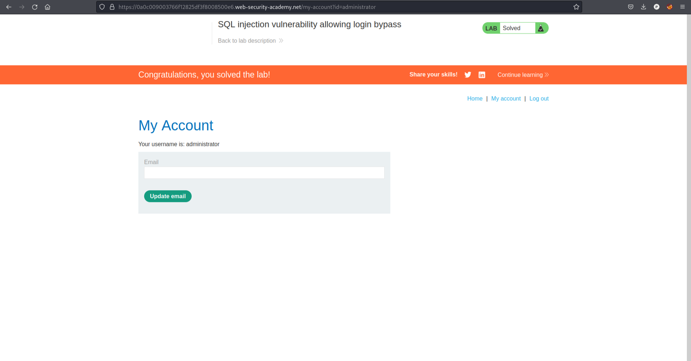

# [Lab 2: SQL Injection Vulnerability Allowing Login Bypass](https://portswigger.net/web-security/sql-injection/lab-login-bypass)

### Overview
This lab demonstrates an SQL injection vulnerability that allows an attacker to bypass the login page.

### Steps to Exploit

1. **Identify the Login Page:**
   - Navigate to the login page of the application.

2. **Test for SQL Injection:**
   - Attempt to log in with the following credentials:
     - **Username**: `admin' or '1'='1`
     - **Password**: `password' or '1'='1`

3. **Confirm the Exploit:**
   - The login is bypassed, and access is granted, confirming the SQL injection vulnerability.
   

### Conclusion
This lab provides a practical example of how SQL injection vulnerabilities can be exploited to bypass authentication mechanisms. It underscores the importance of using parameterized queries and validating user inputs to prevent such attacks.
