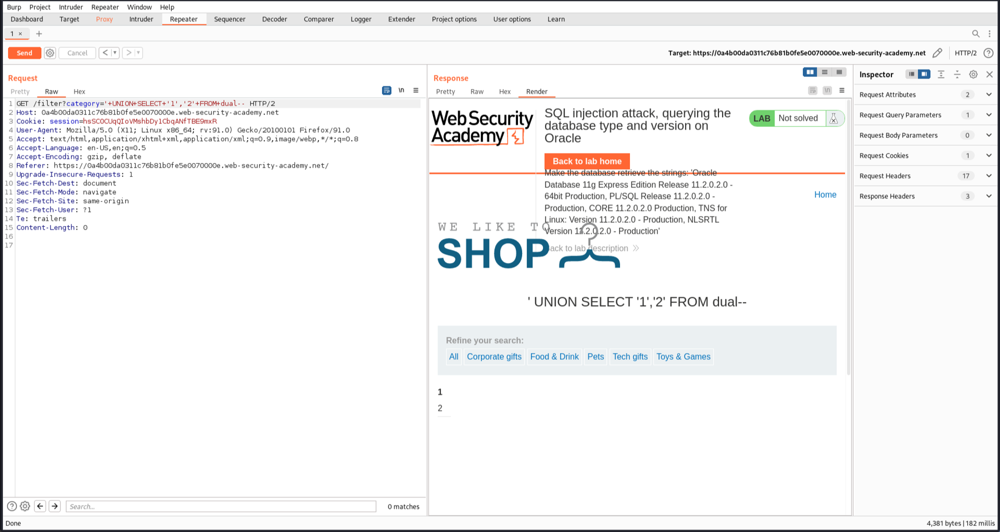
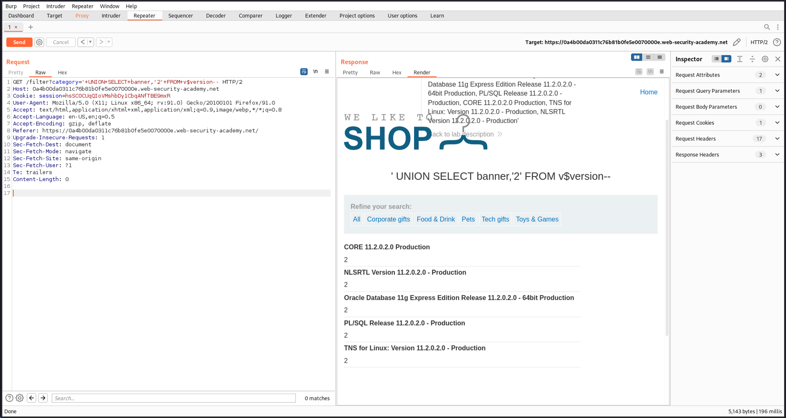
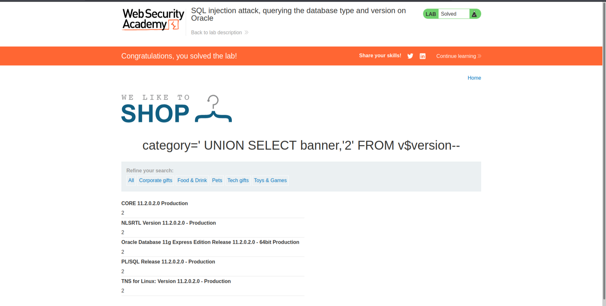

# [Lab 3: SQL Injection Attack, Querying the Database Type and Version on Oracle](https://portswigger.net/web-security/sql-injection/examining-the-database/lab-querying-database-version-oracle)


### Overview
This lab demonstrates an SQL injection attack that allows an attacker to query the database type and version on an Oracle database.

### Steps to Exploit

1. **Identify the Vulnerable Parameter:**
   - Click on one category and intercept the request. Observe that a GET request is sent to `/filter?category=Pets`.

2. **Test for SQL Injection:**
   - Modify the query to:
     ```plaintext
     category='+UNION+SELECT+'1','2'+FROM+dual-- -
     ```
   - This returns "1" and "2" in the response, indicating that the query has two columns.
   

3. **Retrieve Database Version:**
   - Use the information to display the version of the database by changing the query to:
     ```plaintext
     category='+UNION+SELECT+banner,'2'+FROM+v$version--+-
     ```
   - This query retrieves the database version.
   

4. **Confirm the Exploit:**
   - For Oracle databases, `SELECT banner FROM v$version` is used for version detection. The lab is solved when the database version is displayed.
   

### Conclusion
This lab provides a practical example of how SQL injection vulnerabilities can be exploited to query the database type and version. It emphasizes the need for secure coding practices, such as using parameterized queries and input validation, to prevent such attacks.
