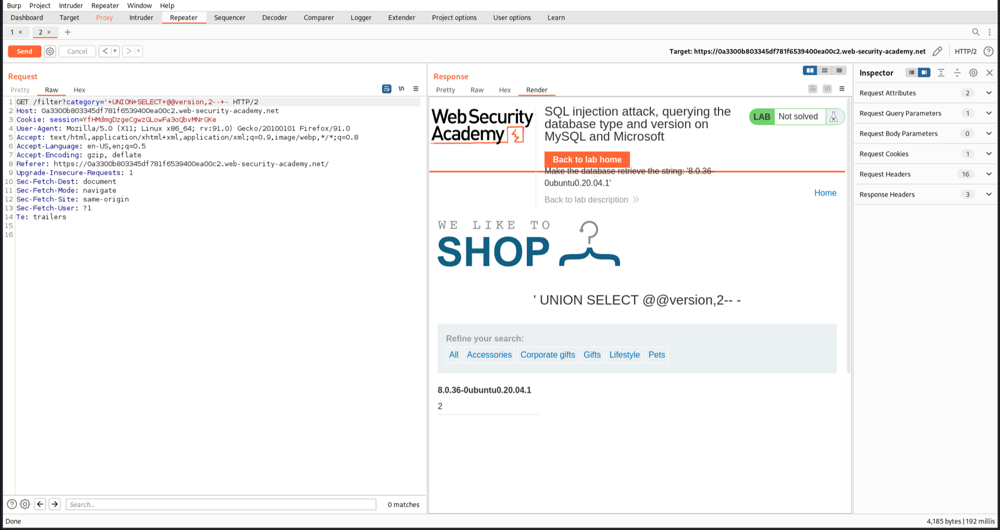
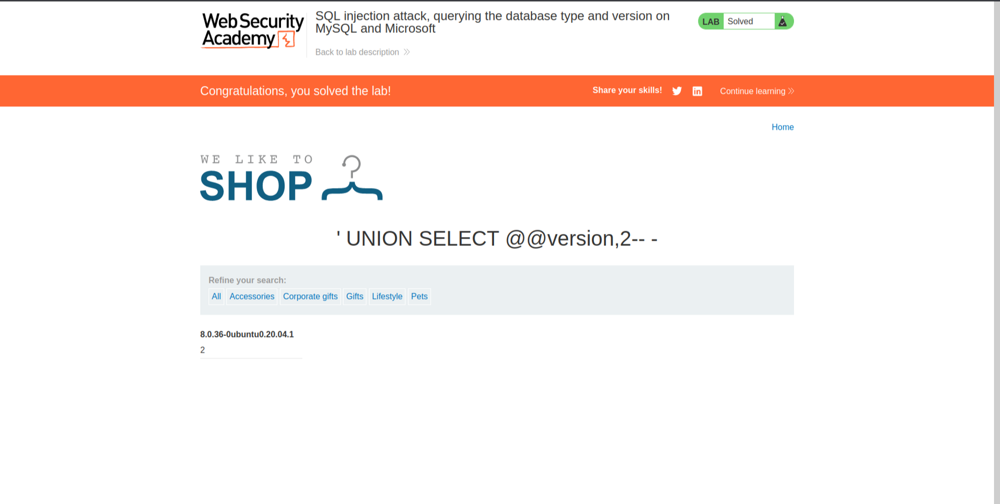

# [Lab 4: SQL Injection Attack, Querying the Database Type and Version on MySQL and Microsoft](https://portswigger.net/web-security/sql-injection/examining-the-database/lab-querying-database-version-mysql-microsoft)


### Overview
This lab demonstrates an SQL injection attack that allows an attacker to query the database type and version on MySQL and Microsoft databases.

### Steps to Exploit

1. **Identify the Vulnerable Parameter:**
   - Click on one category and intercept the request. Observe that a GET request is sent to `/filter?category=Pets`.

2. **Test for SQL Injection:**
   - Modify the query to:
     ```plaintext
     category='+UNION+SELECT+1,2--+-
     ```
   - This returns "1" and "2" in the response, indicating that the query has two columns.
   

3. **Retrieve Database Version:**
   - Use the information to display the version of the database by changing the query to:
     ```plaintext
     category='+UNION+SELECT+@@version,2--+-
     ```
   - This query retrieves the database version.
   

4. **Confirm the Exploit:**
   - The lab is solved when the database version is successfully displayed.
   

### Conclusion
This lab provides a practical example of how SQL injection vulnerabilities can be exploited to query the database type and version on MySQL and Microsoft databases. It underscores the importance of implementing secure coding practices and conducting regular security audits to detect and mitigate such vulnerabilities.
