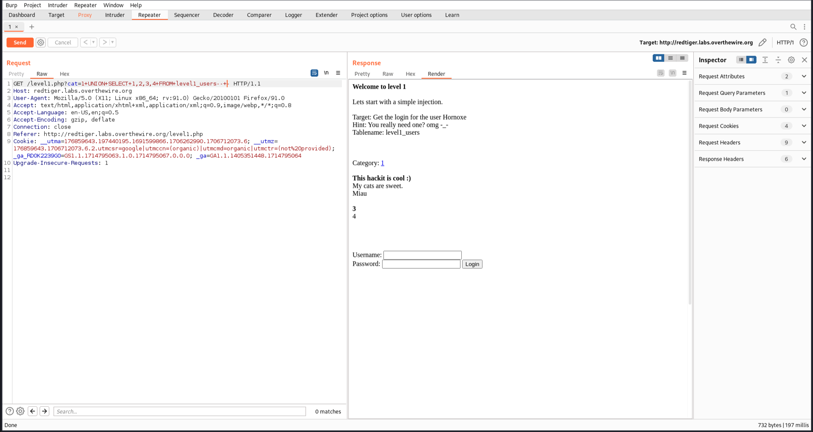
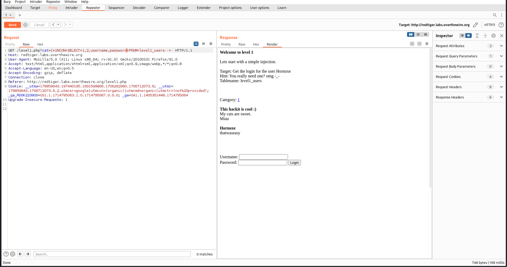

# [Lab 1: Simple SQL-Injection](http://redtiger.labs.overthewire.org/level1.php)

### Overview
This lab demonstrates a simple SQL injection attack that allows an attacker to extract sensitive information and bypass authentication.

### Steps to Exploit

1. **Identify the Vulnerable Parameter:**
   - Click on a category and intercept the request. Observe that a GET request is sent to `/level1.php?cat=1`.

2. **Test for SQL Injection:**
   - Modify the query to:
     ```plaintext
     /level1.php?cat=1+UNION+SELECT+1,2,3,4+FROM+level1_users--+-
     ```
   - This returns "3" and "4" in the response, indicating that additional information can be extracted.
   

3. **Retrieve Username and Password:**
   - Use the information to display the username and password by changing the query to:
     ```plaintext
     /level1.php?cat=1+UNION+SELECT+1,2,username,password+FROM+level1_users--+-
     ```
   - The username and password are displayed.
   

4. **Login with Obtained Credentials:**
   - Use the extracted credentials to log in. Obtain the flag and password for the next level upon successful login.
   

5. **Confirm the Exploit:**
   - The lab is solved when the flag and password for the next level are retrieved.
   
### Conclusion
This lab illustrates how SQL injection vulnerabilities can be leveraged to extract sensitive information and escalate privileges within an application. It underscores the critical importance of implementing robust input validation and secure coding practices to prevent such attacks.
